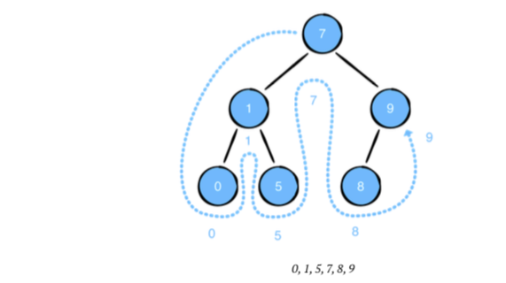
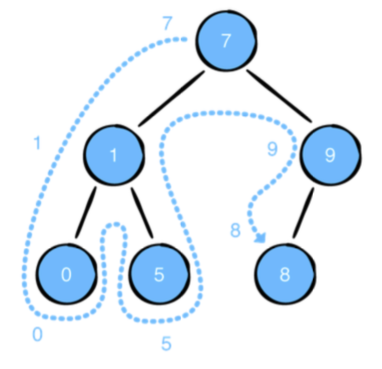
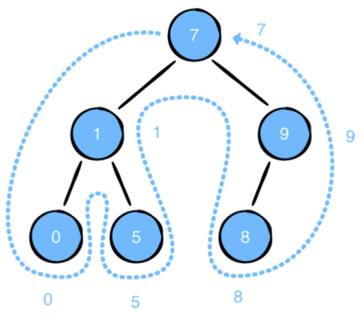

# Binary Tree

A binary tree is a tree where each node can have a max of 2 children.

### Binary Node Implementation
```swift
public class BinaryNode<Element> {
  public var value: Element
  public var leftChild: BinaryNode?
  public var rightChild: BinaryNode?

  public init(value: Element) {
    self.value = value
  }
}
```

```swift
extension BinaryNode: CustomStringConvertible {
	public var description: String {
		return diagram(for: self)
	}
	private func diagram(for node: BinaryNode?,
		_ top: String = "",
		_ root: String = "",
		_ bottom: String = "") -> String {
		guard let node = node else {
			return root + "nil\n"
		}
		if node.leftChild == nil && node.rightChild == nil {
			return root + "\(node.value)\n"
		}
		return diagram(for: node.rightChild,
			top + " ", top + "┌──", top + "│ ")
		+ root + "\(node.value)\n"
		+ diagram(for: node.leftChild,
			bottom + "│ ", bottom + "└──", bottom + " ")
	} 
}

```

## Traversal

#### In-Order
Goes in the following order
- If the current node has a left child, recursively visit the left child
- Then visit the node
- if the node has a right child visit it recursively



```swift
extension BinaryNode {
	public func traverseInOrder(visit: (Element) -> Void) {

		// Visit left child recursively
		leftChild?.traverseInOrder(visit: visit)

		// Visit Current Node
		visit(value)

		// Visit right children recursively
		rightChild?.traverseInOrder(visit: visit)
	} 
}
```


### Pre-Order
- Visit current node
- Left child recursively
- Right child recursively



```swift
public func traversePreOrder(visit: (Element) -> Void) {
  visit(value)
  leftChild?.traversePreOrder(visit: visit)
  rightChild?.traversePreOrder(visit: visit)
}
```

### Post-Order
- Visit left child recursively
- Visit Right Child recursively
- Visit current node



```swift
public func traversePostOrder(visit: (Element) -> Void) {
  leftChild?.traversePostOrder(visit: visit)
  rightChild?.traversePostOrder(visit: visit)
  visit(value)
}
```

## Challenge
A common task in software development is serializing an object into another data type. This process is known as serialization, and allows custom types to be used in systems that only support a closed set of data types.
An example of serialization is JSON. Your task is to devise a way to serialize a binary tree into an array, and a way to deserialize the array back into the same binary tree.

#### Starter
```swift
var tree: BinaryNode<Int> = {
  
  let root = BinaryNode(value: 15)
  let ten = BinaryNode(value: 10)
  let five = BinaryNode(value: 5)
  let twelve = BinaryNode(value: 12)
  let twentyFive = BinaryNode(value: 25)
  let seventeen = BinaryNode(value: 17)
  
  root.leftChild = ten
  root.rightChild = twentyFive
  ten.leftChild = five
  ten.rightChild = twelve
  twentyFive.leftChild = seventeen
  
  return root
}()
```


```swift
// This works but has performance problems because of multiple array creations
func serialize<T>(_ node: BinaryNode<T>) -> [T?] {
    var arr = [T?]()
    arr.append(node.value)

    if let left = node.leftChild {
       arr.append(contentsOf: serialize(left))
    } else {
        arr.append(node.leftChild?.value)
    }

    if let right = node.rightChild {
        arr.append(contentsOf: serialize(right))
    } else {
        arr.append(node.rightChild?.value)
    }

    return arr
}
```

The more efficient way requires changing `func traversePreOrder`

```swift
extension BinaryNode {
  public func traversePreOrder(visit: (Element?) -> Void) {
    visit(value)
    if let leftChild = leftChild {
      leftChild.traversePreOrder(visit: visit)
    } else {
		visit(nil) }
    if let rightChild = rightChild {
      rightChild.traversePreOrder(visit: visit)
	} else {
		visit(nil) }
	} 
}

func serialize<T>(_ node: BinaryNode<T>) -> [T?] {
  var array: [T?] = []
  node.traversePreOrder { array.append($0) }
  return array
}
```

```swift
func deserialize<T>(_ arr: inout [T?]) -> BinaryNode<T>? {
    guard let value = arr.removeFirst() else {
        return nil
    }

    let node = BinaryNode(value: value)
    node.leftChild = deserialize(&arr)
    node.rightChild = deserialize(&arr)
    return node
}

var arr = [15, 10, 5, nil, nil, 12, nil, nil, 25, 17, nil, nil, nil]

if let newTree = deserialize(&arr) {
    print(newTree)
}
```

### Other Challenge
Given a binary tree, find the height of the tree. The height of the binary tree is determined by the distance between the root and the furthest leaf. The height of a binary tree with a single node is zero, since the single node is both the root and the furthest leaf.