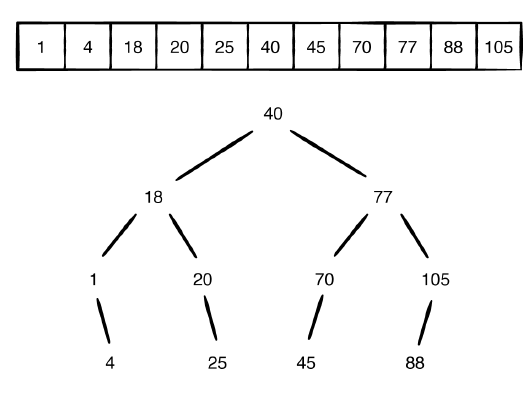
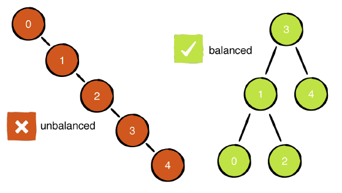
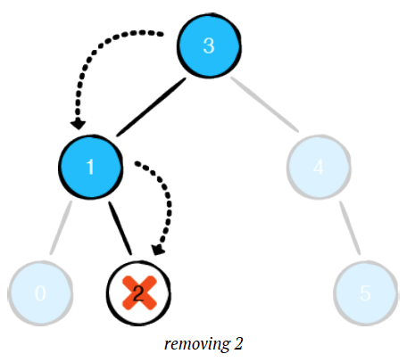
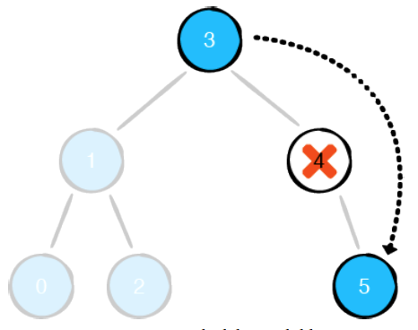
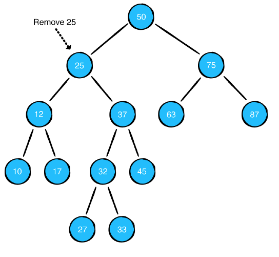
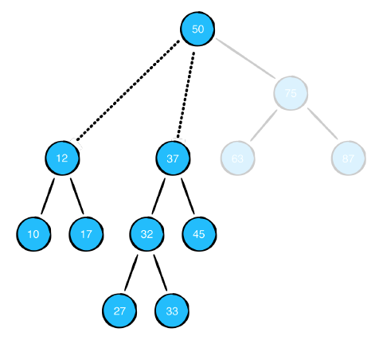
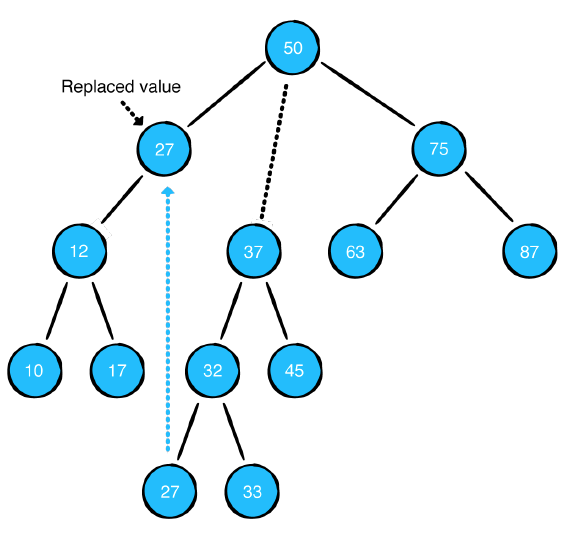

# Binary Search Trees

A binary search a tree is a data structure meant for fast look, insertion & deletion. A BST unlike a linked list does have a parent structure that holds all the nodes.

#### Criteria for a BST
- Left node is less than it's parent
- Right node is greater than the parent

Because of the less than greater than nature of a BST finding a value can be much faster than an array.



Finding the value of 105 in the array would be `O(n)` (11 steps) but a BST would be `O log n` (3 steps)

## Operations

### Insertion
In an array to prepend a value at the beginning is an `O(n)` operation becase once the value is inserted at the beginning everything else must be moved down by 1 space. In a BST the concept of prepend doesn't exist but to insert the value in order would be `O log n`

```swift
public struct BinarySearchTree<Element: Comparable> {
	public private(set) var root: BinaryNode<Element>?
	public init() {}
}
extension BinarySearchTree: CustomStringConvertible {
	public var description: String {
		guard let root = root else { return "empty tree" }
		return String(describing: root)
	}
}

// MARK: - Insertion
extension BinarySearchTree {

	public mutating func insert(_ value: Element) {
		root = insert(from: root, value: value)
	}

	private func insert(from node: BinaryNode<Element>?, value: Element) -> BinaryNode<Element> {
		
		// If the node does not exist create and return a new node	
		guard let node = node else {
			return BinaryNode(value: value)
		}

		if value < node.value {

			// If the value being inserted is less than the nodes value
			// Add as the left child
			node.leftChild = insert(from: node.leftChild, value: value)

      } else {

       // Otherwise the value is greater than the parent and goes
       // on the right
       node.rightChild = insert(from: node.rightChild, value: value)
     }

     // returns node	
     return node
   }
 }
 ```

 **Example**
 ```swift
 var bst = BinarySearchTree<Int>()
  (0..<5).forEach { bst.insert($0) }
  ```

  This creates the tree below
  

  In the tree above looking for the value of `4` would be an `O(n)` operation. This defeats the entire purpose of a BST. There are techniques to create self-balancing trees. That won't be covered in this lesson.

  **Pre-Balanced Tree**
  ```swift
  var exampleTree: BinarySearchTree<Int> {
   var bst = BinarySearchTree<Int>()
     bst.insert(3)
     bst.insert(1)
     bst.insert(4)
     bst.insert(0)
     bst.insert(2)
     bst.insert(5)
     return bst
   }
   ```

   ### Searching a BST

   **Naive Contains**
 ```swift
 extension BinarySearchTree {
   public func contains(_ value: Element) -> Bool {
     guard let root = root else {
       return false
     }
     var found = false
     root.traverseInOrder {
       if $0 == value {
         found = true
      }
    }
    return found
  }
}
```

The above doesn't use any of the features a BST has to offer. It will search in order for the value, rather than using the less than, greater than child node logic to more efficiently find the value being searched for.

**Optimized Contains**
```swift
public func contains(_ value: Element) -> Bool {

	// Sets current node to root node for first iteration
	var current = root

	// Loop while there is a node available
	while let node = current {

		// If the node's value is the one being searched for
		// return true
		if node.value == value {
			return true
		}

		// If the value being searched for is less than the node's value
		// it will be a descendant of the left child
		if value < node.value {

      // Set current to left child for next iteration	
      current = node.leftChild

      } else {

        // If the value being searched for is greater than
        // the current value it will be a descendant of the
        // right child
        current = node.rightChild
      }
    }
  }
```

  By using the less than, greater than information of the children it is much faster to search for the value being looked for.

  ### Removal
  There are 3 scenarios for removing a node

  **Removing a leaf node**
  * Simply detach the node, nothing else to worry about

  

  **Removing a node with 1 child**
  - If the node has 1 child that child must be connected with the node's parent

  

  **Removing a node with 2 children**
  - A node with 2 children is more complex. See below how removing 25 would create a problem of where to place the children. There must be logic to keep the tree valid.

  

  - See how simply removing 25 will create an invalid tree because the parent node will have 3 children

  

  - By replacing the value being removed, with the leftmost node of the right subtree the BST will stay valid

  

  #### Implementation
  ```swift
  private extension BinaryNode {

   // Finds the minimum value of the node's descendants or itself
   var min: BinaryNode {
    return leftChild?.min ?? self
  }
}

extension BinarySearchTree {
	public mutating func remove(_ value: Element) {
		root = remove(node: root, value: value)
	}

	private func remove(node: BinaryNode<Element>?, value: Element) -> BinaryNode<Element>? {
		guard let node = node else {
			return nil
		}

		if value == node.value {

			// If the node is a leaf node return nil (this will remove the node)	
			if node.leftChild == nil && node.rightChild == nil {
				return nil
			}

			// If there is no left child, return the right node to be reconnected
			// to the subtree
			if node.leftChild == nil {
				return node.rightChild
			}

			// If the node has no right child, return the left child to be reconnected
			// to the subtree	
			if node.rightChild == nil {
				return node.leftChild
			}

			// This is a 2 child node, it will recursively search down to the leftmost
			// node of the right subtree (the minimum value on the right) and set it
			// to the value of the current node that is being removed
			node.value = node.rightChild!.min.value

			// At this point the value just set above exists twice in the tree
			// Search and remove the value from the right subtree
			node.rightChild = remove(node: node.rightChild, value: node.value)
			

			} else if value < node.value {
				node.leftChild = remove(node: node.leftChild, value: value)
       } else {
        node.rightChild = remove(node: node.rightChild, value: value)
      }
      return node
    }
  }
```
