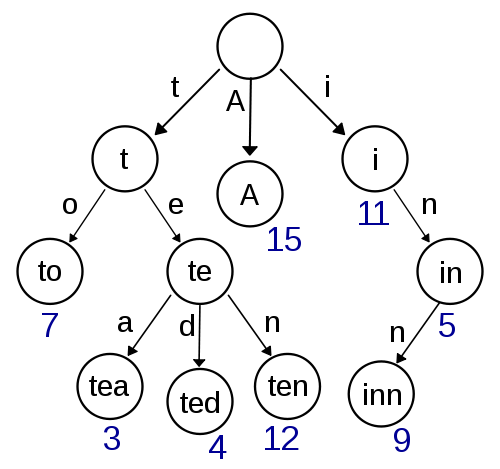

# Tries

Pronounced as try...s. A trie is a data structure for storing data that can be represeneted as a collection, like a word. Characters would map to a node in the trie.

Wikipedia:
In computer science, a trie, also called digital tree, radix tree or prefix tree, is a kind of search tree—an ordered tree data structure used to store a dynamic set or associative array where the keys are usually strings. Unlike a binary search tree, no node in the tree stores the key associated with that node; instead, its position in the tree defines the key with which it is associated. All the descendants of a node have a common prefix of the string associated with that node, and the root is associated with the empty string. Keys tend to be associated with leaves, though some inner nodes may correspond to keys of interest. Hence, keys are not necessarily associated with every node. For the space-optimized presentation of prefix tree, see compact prefix tree.



See how in the example nodes are organized around the prefix of the words, making it easier to search through the tree looking for the data. Compare this to an array, where say you have 10k words and you need to find the one that the user is typing for an autocomplete engine. It would be terrible performance to hunt through 10k words matching the current state of the user's input to the all the possible words that start with the current input state. Using an array would be `O(k*n)` where `k` is the longest string in the collection and `n` the number of words in the collection. If you were searching for `Supercalifragilisticexpialidocious` in a 10k long array it would be `O(34,000)` 


#### Trie Node

```swift
public class TrieNode<Key: Hashable> {

  // Optional because the root node has no key
  public var key: Key?

  // Holding a reference to the parent helps in remove operations
  public weak var parent: TrieNode?

  // BST's hold only 2 children, because a node can have > 2 children
  // A dictionary is a better option for efficiently storing children
  public var children: [Key: TrieNode] = [:]

  // Lets node know if it is a leaf or not
  public var isTerminating = false

  public init(key: Key?, parent: TrieNode?) {
    self.key = key
    self.parent = parent
  }
}
```

#### Trie Structure

```swift
public class Trie<CollectionType: Collection>  where CollectionType.Element: Hashable {

  // Create a typealias to make typing the type easier down the road
  public typealias Node = TrieNode<CollectionType.Element>

  // Iniitialize the trie w/ a nil root node
  private let root = Node(key: nil, parent: nil)

  public init() {}
}
```