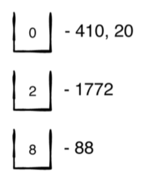
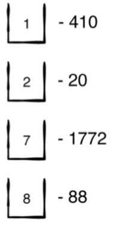
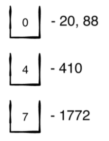
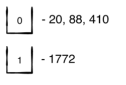

# Radix or Bucket Sort

Radix is a non-comparison sorting algorithm. It uses a series of buckets to place individual values. We'll take each number and break it into it's parts 1's, 10's, 100's, 1000's, etc. and put each value in it's respective bucket.

## Performance
Radix is one of the fastest sorting algorithms

`O(k x n)`  
`k`: Number of significant digits of the largest number (1772 would be 4)  
`n`: Number of elements in the array

A 4 element array with the largest element being `1000` would be `O(16)`

## First Iteration
`let arr = [88, 410, 1772, 20]` we place each number into the corresponding bucket based on the first number (ones or rightmost digit)


## Second Iteration

Array is now `[410, 20, 1772, 88]` and we place each number into the corresponding bucket by the 2nd digit (tens)


## Third Iteration
The array did not change because the 2nd digits were already in sorted order. The array is still `[410, 20, 1772, 88]` and now we place each number into a bucket based on the 3rd digit (hundreds). Notice in this iteration that some digits don't have a hundreds digit, they will be grouped in the 0 bucket.


## Fourth Iteration
The array is now `[20, 88, 410, 1772]`. Though the array is already sorted we will continue sorting until the largest digit `1772` has had all it's digits sorted. And similar to before, most of the array is in the 0 bucket except `1772`


# Implementation
```swift
extension Array where Element == Int {
    public mutating func radixSort() {

        // We're working with base 10 so 10 is our starting point
        let base = 10

        // Var to track whether we're done and to signal to the loop
        // that it should continue or not continue looping
        var done = false

        // Tracks which digit you're at 12345 -> 5 is 1, 4 is 2, 3 is 3, 2 is 4, 1 is 5
        var digits = 1

        while !done {
            done = true

            // Make a 2 dimensional array, of 0 - 9 each index reprenting the value at the index
            var buckets: [[Int]] = .init(repeating: [], count: base)

            // Iterate on self
            forEach { number in
                print("Number: \(number) :: Digits: \(digits)")

                // Divide the number by the current digit (1, 10, 100)
                // If say we have the number 410 and the digit is 10
                // our remaining part becomes 41
                let remainingPart = number / digits
                print("Remaining: \(remainingPart)")

                // Get the digit position
                let digit = remainingPart % base

                // Go to the index of the digit and add the number
                buckets[digit].append(number)

                if remainingPart > 0 {
                    done = false
                }
            }

            // As we advance through 1, 10, 100, etc. we multiply the base by the current digit position
            digits *= base

            // Flatten the nested array
            self = buckets.flatMap { $0 }
        }
    }
}

  var array = [88, 410, 1772, 20]
  print("Original array: \(array)")
  array.radixSort()
  print("Radix sorted: \(array)")
```